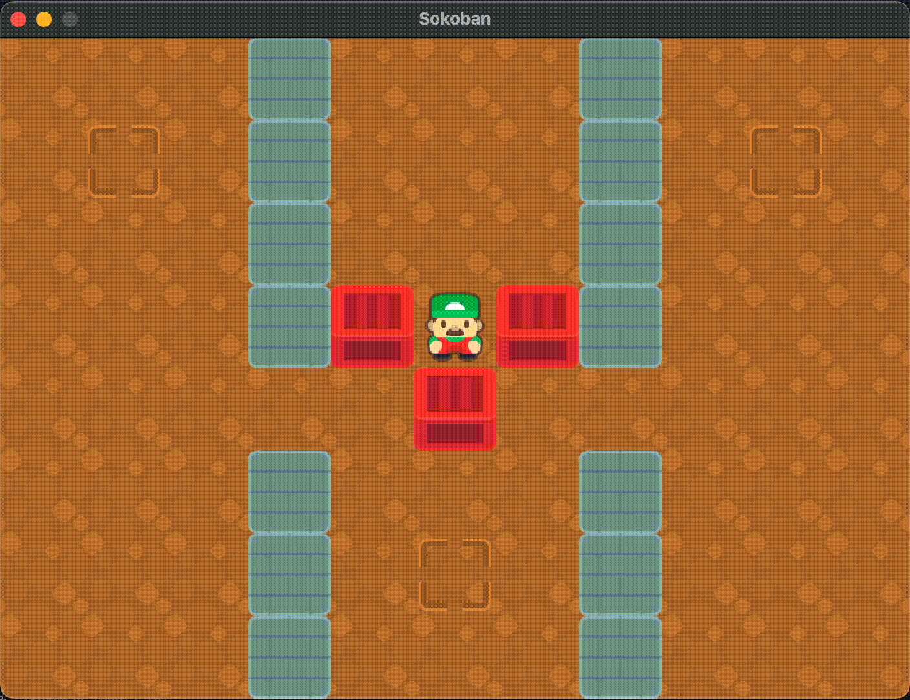

# Sokoban Game :gift: :pager:

Sokoban puzzle game written in C++, the objective is to move all crates to correct locations.

## Description

First published in December 1982, Sokoban is a game in which you are a warehouse employee who has to move crates around onto specific targets.  This project was originally part of a coding course in university.  I recreated the game with the SFML graphics library.  



## Getting Started

### Dependencies

* In order to compile you will need to hard modify the makefile to link to your installation of SFML.

### Installing

* Compile with Makefile first.

### Executing program

* Once executable is in directory:
```
./Sokoban level1.lvl
```

## Authors

:key: ListenToAJ

## Version History

* 0.1
    * Initial Release
    * Fully functional prior to GitHub upload*


## License

Copyright 2024 Anthony Simao

## Acknowledgments

* [Sokoban Graphics Pack](https://kenney.nl/assets/sokoban)